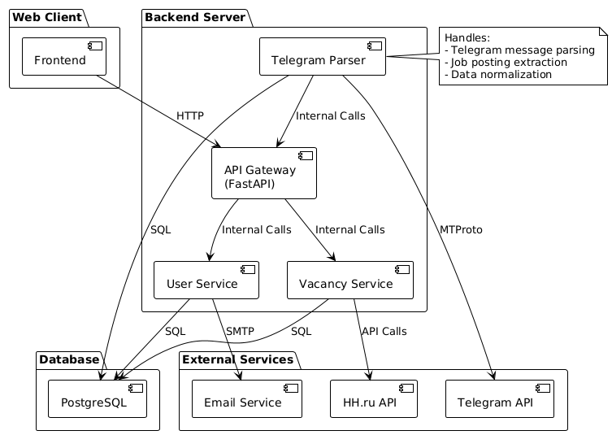
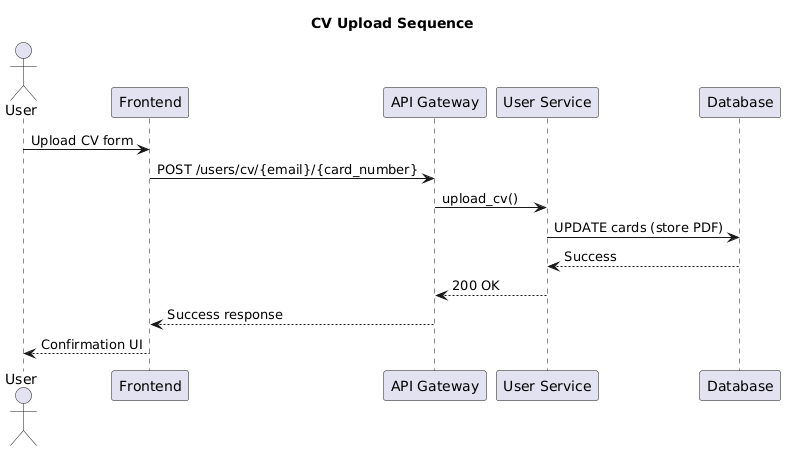
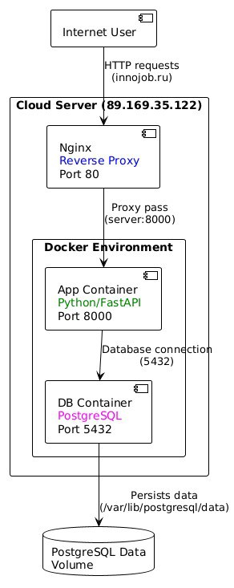

# InnoJob - your last stop before you find your job in Innopolis SEZ!

InnoJob aggregates all vacancies from all headhunting sites that are available in Innopolis Special Economic Zone

[innojob.ru](http://innojob.ru)

*Video Placeholder*

***

# Project Information

## Project Context

## Roadmap

- [x] Job listing
    - [x] Vacancies from HH.ru
    - [ ] Vacancies from SuperJob
    - [ ] Vacancies/Internships from Telegram
- [X] User
    - [ ] User authentication
    - [x] CV Upload
        - [x] "Skiils" field
        - [x] Bio
    - [ ] Privacy settings
- [ ] Job hunter listing
    - [ ] Cards based on user CV
    - [ ] "Contact person" button
        - [ ] via Email
        - [ ] via Telegram

# Usage

1. Access site via [innojob.ru](http://innojob.ru)
2. Click the "Find the job" or choose "Log In" to log into site with your account

    1. In case if you don't have an account, you should sign up by clicling according button
3. After you log in with your credentials, you will get access to `/job_listing` with vacancies.
4. You can access your user profile by clicing on icon with person

    1. In your profile you can upload one CV and change information about yourself

- Job hunters listing is still in development

## Deployment

### Requirments

In order to deploy project, you need to instal `docker`

### Running project

Run `docker compose up --build` to run the project. By default, the site can be accessed via your IP addres and port `80`, however, you can change port by editing `nginx/nginx.conf`

# Architecture

### Static view

The system follow layered microservice architecture with external services integration

1. Components

    1. Frontend: HTML/CSS/JS
    2. API: FastAPI for handling HTTP requests
    3. User service: manages accounts and authentification
    4. Vacancy service: Manages job vacancies and parser
    5. Database: Data storage via PostgreSQL
    6. HH.ru API/ Telegram API: external services
2. Coupling and Cohesion:

    1. Coupling: Loose coupling via microservices architecture
    2. Cohesion:

        1. User/Vacancy service: High cohesion with related operations
        2. Database access encapsulated
3. Maintainability impact:

    1. Clear separation of functionality improves maitainability
    2. Independent service development
    3. Database abstraction allows schema changes
    4. Well-defined API backend/frontend contrast

### Dynamic view

Non-trivial request: CV upload

1. Sequence Description

    1. User submits CV via web form
    2. Frontend sends PDF to API gateway
    3. API gateway routes to user sevice
    4. User service stores CV in database as bytecode
    5. Database confirms successfull write
    6. Success responce returned to user
2. Performance metric

    1. Average time of request: 280 ms

### Deployment view

1. App is deployed in `Docker Compose` via `python` and `postgres` images

2. Docker exposes only `8080` port for `fastAPI` backend.

3. `nginx` on server forwards `8080` port to `80` and `innojob.ru` to `89.169.35.122`

It can be deployed on client server via `docker compose up` in the root of project, although it would be available on different port (`8080`)

# Development

## Kanban Boards

[GitLab Boards](https://gitlab.pg.innopolis.university/m.krylov/scareerz/-/boards) - there're two boards: **Development** and **Acceptance criteria status.**  *GitLab does not provide seperate links for individual boards*

### **Acceptance criteria status (board)**

*Acceptance criteria status* is tracking board  feature *is running on local (developer) machine,*  *approved by other developers, deployed on server,*  or *needs fixing.*  Issues appear on this board if issues is not closed and have label representing

| Collumn name             | Criteria                                                   |
| -------------------------- | ------------------------------------------------------------ |
| Needs fixing             | Issue that represent bug that needs immediate fix         |
| Deployed                 | Features that deployed on remote server                    |
| Approved                 | Feature reviewed by whole team and approved                |
| Running on local machine | Developer that worked on feature managed to run it locally |

### Development (board)

*Development* board is essentially a backlog. Has all *issues,*  collumns are sorted by issue priority via labels

| Collumn name                    | Criteria                                                                               |
| --------------------------------- | ---------------------------------------------------------------------------------------- |
| Needs fixing                    | Issue that represent bug that needs immediate fix                                      |
| In progress                     | Issues that are currently in work                                                      |
| Must implement (first priority) | Issues that represent PBI that is not currently in work but should be implemented ASAP |
| Nice to have (second priority)  | Issues that represent PBI that is not currently in work and can be not yet implemented |

## Git workflow

### Stable/unstable branches, branch managment

- The `main` branch is **stable** channel. We push to `main`only at the end of sprints.
- The `sprint-*` branches are **unstable** channel in which we create individual issue branches (i.e `iss-46`).
- After the issue is closed, respective **issue branch** gets merged into unstable channel (i.e `sprint-1`) and issue branch is deleted.
- `Main` and `sprint-*` branches are **protected**. We would use **code reviewes** for merge requests if this was an option on GitLab, but this feature is available only for Premium users, so we're forced to prohibit pushes on main branches and review mergres to these branches in person on team meetings

### Issues

- Issues are **created** via [templates](https://gitlab.pg.innopolis.university/m.krylov/scareerz/-/tree/main/.gitlab/issue_templates?ref_type=heads). The name of issue should be descriptive, but concise. It should be clear what feature is implemented under that issue
- Issues are **assigned** to team members in accordance to their competence or by self-assigning. There's no one person responsible for assigning team members to issues.
- Issue is generally **closed** when the person assigned to it says that is done. If other developers consider already closed issue as not finished - they create new issue and define individual aspects of issue that still needs work

# Code review, commiting, merge requests

- **Code reviewes** are performed on offline meeting with wholde team
- It is recomended to keep **commit messages** short, concise, and in English, although no one really enforces these rules
- **Merge requests** are mandatory for any merge to `main` and `sprint-*` branches, as they are protected, but there's no defined procedure for this

### GitGraph

## Secrets managment

- Honestly - I haven't heard about it until this assigment. While we're in production and haven't released the app yet, we're working in private repository and store all secrets in plain text files.

# Quality Assurance

## User Acceptance Tests

[user-acceptance-tests.md](https://gitlab.pg.innopolis.university/m.krylov/scareerz/-/blob/main/docs/quality-assurance/quality-attribute-scenarios?ref_type=heads)

## Automated Tests

1. Tools used for testing:

    1. Pytest for integration and unit tests
    2. Unittest MagicMock for mocking
    3. Flake8 for linter testing
2. Types of tests implemented:

    1. Integration tests
    2. Unit tests
    3. Linter test
    4. Tests in the repository

        1. Integration tests: scareerz/tests/integration https://gitlab.pg.innopolis.university/m.krylov/scareerz/-/tree/main/tests/integration

        1. Unit tests: scareerz/tests/unit https://gitlab.pg.innopolis.university/m.krylov/scareerz/-/tree/main/tests/unit
        2. Linter test: scareerz/flake8_report.txt https://gitlab.pg.innopolis.university/m.krylov/scareerz/flake8_report.txt

## Build and Deployment

### Continuous Integration

[CI Pipeline configuration in GitLab](https://gitlab.pg.innopolis.university/m.krylov/scareerz/-/blob/main/.gitlab-ci.yml?ref_type=heads) and [CI runs in GitLab](https://gitlab.pg.innopolis.university/m.krylov/scareerz/-/pipelines)

### Static Analysis/Testing Tools

- For now, we use only `flake8` linter, as it reviewes Python code, which is the main language for our project
- And for testing we use `pytest`, as it is also built for Python code.
